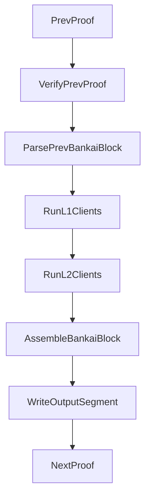

# BankaiOS Architecture (Cairo)

This document proposes a Cairo-side architecture upgrade that turns the current single Ethereum light client flow into a modular, extensible system. The goal is to keep light clients standalone, let BankaiOS orchestrate recursion and output assembly, and make it easy to add L1 and L2 light clients without changing their internal logic.

## Goals and Constraints

- BankaiOS wraps recursion, verifies previous proofs, and constructs the new output block.
- Each run outputs a Bankai block containing: `version`, `layout_id`, `block_number`, and the outputs of integrated light clients.
- Program hash must be consistent across recursive iterations; add a clear upgrade hook for a future hardfork.
- Light clients own their own types and read all witness inputs inside the light client module.
- Light clients are standalone modules; BankaiOS integrates them but does not own their internal data.
- L2 light clients follow the same interface as L1 but additionally receive the current L1 output.

## Current Cairo Flow (Reference)

The current system is organized around a single Ethereum light client. These are the key facts we preserve:

- Entry points call `run_bankai()` in `cairo/src/lib.cairo` (`bankai_stwo.cairo`/`bankai_stone.cairo`).
- `run_bankai()` reads consensus inputs and flags via hints, chooses genesis vs recursive, and writes output via `write_circuit_output`.
- `handle_recursive_case()` loads `previous_output` via hint and computes `expected_output_hash` using `compute_output_hash` in `cairo/src/recursion/proof_output.cairo`.
- Recursion verification code exists in `cairo/src/recursion/stone.cairo` but is currently commented.
- Output format is fixed (20 felts) and defined by `CircuitOutput2` in `cairo/src/io.cairo`.
- Ethereum logic lives in `cairo/src/bls/verify_epoch.cairo` (`run_beacon_update`, `run_execution_update`).

These constraints drive the BankaiOS design: output serialization must be deterministic and hashable, proof verification should use the same pattern as current `compute_output_hash`, and light clients must be fully self-sufficient.

## BankaiOS Module Layout

Proposed Cairo layout (new modules):

- `cairo/src/bankai_os/lib.cairo`
  - Main wrapper: `run_bankai_os()`
  - Genesis vs recursive handling
  - Proof verification + program hash check
  - Light client orchestration
  - Output assembly

- `cairo/src/bankai_os/block.cairo`
  - Bankai block header + serialization format
  - Block parser (`BankaiBlockView`)
  - Client record scanning utilities

- `cairo/src/bankai_os/recursion.cairo`
  - Proof verification helper (`verify_previous_proof`)
  - Output hash computation for Bankai block

- `cairo/src/light_clients/registry.cairo`
  - Static list of light clients in order
  - Client IDs, output lengths
  - Runs L1 clients, then L2 clients

- `cairo/src/light_clients/<client_name>/`
  - Light client module owns its types and logic
  - Exposes a BankaiOS-facing entrypoint

BankaiOS can be compiled with an empty registry and still function (it will only output block header fields).

## Bankai Block Format

### Header
BankaiOS emits a single output segment encoding the block in this order:

1. `version` (felt)
2. `layout_id` (felt) — identifies the Bankai block layout, not the Cairo layout
3. `block_number` (felt)

### Client Records
Each client writes a record immediately after the header, in registry order:

```
client_id, payload_len, payload[0..payload_len-1]
```

This format lets clients remain independent of offsets and allows BankaiOS to add new clients without changing existing client logic. `layout_id` is bumped whenever the registry or serialization changes (hardfork boundary). The number of clients is implied by the compiled registry (no `n_clients` field needed).

### Output Hash
Follow the existing pattern in `cairo/src/recursion/proof_output.cairo`:

- Compute `output_hash = poseidon_hash_many(n=output_len, elements=output)`
- Keep a small domain separator prefix (e.g. `version` and `layout_id`) in the output itself
- Include `program_hash` in the hash computation exactly as today (as the first data element after the prefix)

This keeps the recursion check aligned with the current `compute_output_hash` while enabling variable-length output.

### Minimal Cairo Example (Block Serialization)

```cairo
struct BankaiBlock {
    version: felt,
    layout_id: felt,
    block_number: felt,
}

func write_block_header{output_ptr: felt*}(header: BankaiBlock) -> (next_ptr: felt*) {
    assert [output_ptr] = header.version;
    assert [output_ptr + 1] = header.layout_id;
    assert [output_ptr + 2] = header.block_number;
    return (next_ptr=output_ptr + 3);
}

func write_client_record{output_ptr: felt*}(
    client_id: felt, payload: felt*, payload_len: felt
) -> (next_ptr: felt*) {
    assert [output_ptr] = client_id;
    assert [output_ptr + 1] = payload_len;
    memcpy(dst=output_ptr + 2, src=payload, len=payload_len);
    return (next_ptr=output_ptr + 2 + payload_len);
}
```

## Light Client Interface (Standalone, Own Types)

Each light client module exposes its own types and a BankaiOS entrypoint that only depends on `BankaiBlockView` (from BankaiOS) and its own types.

### Standard L1 Light Client

```cairo
// light_clients/ethereum/types.cairo
struct EthereumOutput {
    // beacon + execution fields (owned by Ethereum module)
}

const CLIENT_ID = 1;

// light_clients/ethereum/lib.cairo
func read_prev_from_block(prev_block: BankaiBlockView) -> (prev: EthereumOutput) {
    let (payload_ptr, payload_len) =
        bankai_os.block.get_client_payload(prev_block, CLIENT_ID);
    return (prev=deserialize_output(payload_ptr, payload_len));
}

func run(prev_block: BankaiBlockView) -> (output: EthereumOutput) {
    let (prev) = read_prev_from_block(prev_block);
    // read witness inputs here (hints live inside the client)
    return (output=run_ethereum_update(prev));
}

func write_output{output_ptr: felt*}(out: EthereumOutput) -> (next_ptr: felt*) {
    let (payload_ptr, payload_len) = serialize_output(out);
    return write_client_record(client_id=CLIENT_ID, payload=payload_ptr, payload_len=payload_len);
}
```

### L2 Light Client (Depends on L1 Output)

```cairo
// light_clients/l2_example/lib.cairo
func run(prev_block: BankaiBlockView, parent_l1: EthereumOutput) -> (output: L2Output) {
    let (prev) = read_prev_from_block(prev_block);
    // read witness inputs here
    return (output=run_l2_update(prev, parent_l1));
}
```

Notes:
- `BankaiBlockView` is a lightweight wrapper over the previous block output.
- Light clients own `ClientOutput` types and serialization.
- BankaiOS only coordinates ordering and output assembly.

## BankaiOS Orchestration Flow

High-level steps for `bankai_os/lib.cairo`:

1. Read global flags (genesis vs recursive) and `program_hash` via hint.
2. If recursive:
   - Load previous block output via hint.
   - Compute expected output hash from the previous block.
   - Verify proof output hash + program hash.
3. Parse `BankaiBlockView` from the previous output.
4. Run L1 clients in registry order.
5. Run L2 clients after their parent L1 output is available.
6. Assemble a new `BankaiBlock` and write to the output segment.

Mermaid flow:



## Program Hash Consistency and Upgrade Hook

Program hash consistency is enforced at recursion verification time. In the current code, this happens by checking the proof’s `program_hash` against a constant (see `BOOTLOADER_PROGRAM_HASH` in `cairo/src/lib.cairo`) and by including the program hash in `compute_output_hash`.

Proposed rule in BankaiOS:

- `assert proof_program_hash == BANKAI_PROGRAM_HASH`
- `assert prev_block.layout_id == BANKAI_LAYOUT_ID`
- If you ever want a hardfork, introduce a guarded branch here:

```
// TODO(hardfork): allow program_hash upgrade based on governance proof or epoch
```

This is the only place in the flow where a program hash change should be permitted.

## Registry and Configuration

The registry defines which clients are compiled into BankaiOS and their ordering:

- `light_clients/registry.cairo` imports the clients and exposes:
  - `const CLIENT_IDS: felt*`
  - `const CLIENT_COUNT: felt`
  - `run_all(prev_block) -> (outputs...)`

Adding a new client:

1. Implement the client module with its own types and serialization.
2. Add the module to the registry and bump `BANKAI_LAYOUT_ID`.
3. Recompile and redeploy. Old light clients do not change.

## Migration Plan: Ethereum Light Client

Minimal refactor without changing internal logic:

1. **Move types into the Ethereum module**
   - Move `ConsensusInputs`, `BeaconClientOutput`, `ExecutionClientOutput`, and any Ethereum-specific structs from `cairo/src/io.cairo` to `cairo/src/light_clients/ethereum/types.cairo`.
   - Keep only BankaiOS-level types in `bankai_os/block.cairo`.

2. **Create a BankaiOS entrypoint**
   - New function `ethereum::run(prev_block: BankaiBlockView)` which:
     - Parses previous Ethereum output from the block.
     - Reads witness inputs via the existing hints (move hint calls here).
     - Calls `run_beacon_update` and `run_execution_update` unchanged.

3. **Serialize output into a client record**
   - Implement `serialize_output` to emit the Ethereum output as a felt array.
   - `write_output` emits a client record (client_id + payload_len + payload).

4. **Wire into registry**
   - Add Ethereum to `light_clients/registry.cairo`.
   - Ensure it runs before any L2 clients.

5. **Update recursion hash**
   - Replace `compute_output_hash` to hash the entire Bankai block output (header + client records).
   - Keep the domain separator (current `1, 24` pattern) and include `program_hash` at the top of the output list.

This preserves the Ethereum logic and makes it a drop-in light client module under BankaiOS.

## Notes on Cairo Compatibility

- The client record format is deterministic and friendly to Cairo’s memory model.
- Output length is now variable, but bounded by the registry and client-defined payload lengths.
- `get_client_payload` can scan by `client_id`, so existing clients do not need offset changes when new clients are appended.

---

## Appendix: Type Specifications (Cairo)

This appendix defines the core types BankaiOS needs, with module boundaries made explicit. Light clients own their internal types. BankaiOS only owns the block header + record format and the view helpers used to read client payloads.

### BankaiOS Types (`cairo/src/bankai_os/block.cairo`)

These types belong to BankaiOS. `BankaiBlock` embeds the Ethereum wrapper output (defined in the Ethereum module) while other client types remain fully owned by their modules.

```cairo
// BankaiOS-level block type (header + core L1 output).
// The embedded Ethereum output type is defined in the Ethereum module.
struct BankaiBlock {
    version: felt,
    layout_id: felt,
    block_number: felt,
    ethereum: EthereumClientOutput,
}

// Lightweight view over the previous output segment.
struct BankaiBlockView {
    output_ptr: felt*,
    output_len: felt,
}

// Utility return type for scanning payloads.
struct ClientPayloadView {
    payload_ptr: felt*,
    payload_len: felt,
}
```

### BankaiOS Helpers (`cairo/src/bankai_os/block.cairo`)

These helpers let clients read their own payload without knowing offsets:

```cairo
// Parses the block prefix and decodes the Ethereum output field.
func parse_block(block: BankaiBlockView) -> (block: BankaiBlock) {
    // Read 3 fields from block.output_ptr and decode Ethereum output
}

// Scans client records by client_id and returns the payload range.
func get_client_payload(block: BankaiBlockView, client_id: felt) -> (payload: ClientPayloadView) {
    // Iterate records: [client_id, payload_len, payload...]
}
```

### Ethereum Light Client Types (`cairo/src/light_clients/ethereum/types.cairo`)

The Ethereum module owns all Ethereum-specific structures. BankaiOS references the wrapper type in
`BankaiBlock`, but the definition and serialization live in the Ethereum module.

```cairo
// Wraps all Ethereum light client state.
struct EthereumClientOutput {
    beacon: EthereumBeaconOutput,
    execution: EthereumExecutionOutput,
}

// Beacon-specific output (owned by Ethereum module).
struct EthereumBeaconOutput {
    slot_number: felt,
    header_root: Uint256,
    state_root: Uint256,
    justified_height: felt,
    finalized_height: felt,
    num_signers: felt,
    mmr_root_keccak: Uint256,
    mmr_root_poseidon: felt,
    current_validator_root: felt,
    next_validator_root: felt,
}

// Execution-specific output (owned by Ethereum module).
struct EthereumExecutionOutput {
    block_number: felt,
    header_hash: Uint256,
    justified_height: felt,
    finalized_height: felt,
    mmr_root_keccak: Uint256,
    mmr_root_poseidon: felt,
}
```

**Important:** The Ethereum wrapper type (`EthereumClientOutput`) is serialized into a single client
record in the Bankai block. BankaiOS may decode this record into `BankaiBlock.ethereum`, but other
client records remain opaque and owned by their modules.

### Light Client Entry Types (`cairo/src/light_clients/<client>/lib.cairo`)

Each client module exposes its own entrypoints and serialization helpers:

```cairo
// Standard L1 client entrypoint.
func run(prev_block: BankaiBlockView) -> (output: EthereumClientOutput) {
    // Read previous output + witness inputs internally
}

// Serialization helpers (client-owned).
func serialize_output(out: EthereumClientOutput) -> (payload_ptr: felt*, payload_len: felt) {}
func deserialize_output(payload_ptr: felt*, payload_len: felt) -> (out: EthereumClientOutput) {}
```

### Bankai Block Composition (BankaiOS-Level)

At BankaiOS level, the serialized block contains the header and client records:

```
BankaiBlock = Header | ClientRecord[0..registry_len-1]
ClientRecord = client_id | payload_len | payload[...]
```

For Ethereum, the `payload[...]` bytes are the serialized `EthereumClientOutput` (beacon + execution). This keeps the Ethereum types encapsulated in the light client module while still being part of the Bankai block.

